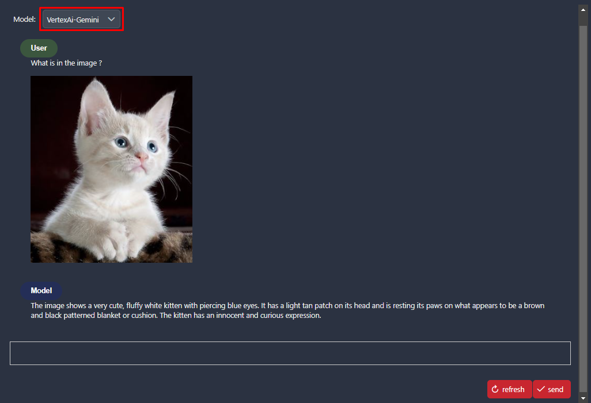

# Vertex AI Google

- Gemini 1.5 Pro is a foundation model that performs well at a variety of multimodal tasks such as visual understanding, classification, summarization, and creating content from image. It's adept at processing visual and text inputs such as photographs and screenshots.
- Our app helps user to chat directly with Gemini 1.5 and VertexAI Gemini 1.5 Pro by sending text and images. It seamlessly allows to toggle between 2 applications together.

## Demo

### Submit with model VertexAI-Gemini

### Submit with model Gemini

### Switch between the two models using a dropdown menu

## Setup

### Gemini

#### Go to Gemini: [Gemini Online](https://aistudio.google.com/app/apikey) and create an API-key

#### Get the API key

### VertexAI

#### Log in to [Vertex Online](https://console.cloud.google.com/) with account

#### Select Dashboard -> Create a new project

#### Copy "Project ID" from project to push to variables file

#### From Dashboard, scroll down to "Getting Started" and select "Explore and enable APIs"

#### Select "ENABLE APIS AND SERVICES"

#### Search "vertex ai api" and enable it (Google Cloud will request billing account) in [Model Garden Gemini-1.5 pro](https://console.cloud.google.com/vertex-ai/publishers/google/model-garden/gemini-1.5-pro-001)

#### Go back to the main page of Google cloud and select **_"IAM & Admin"_**

#### Select **_"IAM & Admin"_** -> **_"Service Accounts"_** -> **_"Create Service Account"_**

#### Create an account and grant permission/role for this account

#### Select the account that just created and select "Key" and choose "ADD key"

#### "ADD Key" -> "Create new Key" -> "Json" -> Google Cloud automatically download a credential json file.

#### Keep this file and put the path of the file to `Variables.vertexai-gemini.keyFilePath`

#### Select the modelName from: [Vertex AI Gemini Model name](https://console.cloud.google.com/vertex-ai/publishers/google/model-garden/gemini-1.5-pro-001)

#### Select the Location from: [Vertex AI Location/Region](https://cloud.google.com/compute/docs/regions-zones)

Add the following `Variables` to your `variables.yaml`:

- `Variables.vertexai-gemini.projectId`
- `Variables.vertexai-gemini.location`
- `Variables.vertexai-gemini.modelName`
- `Variables.vertexai-gemini.keyFilePath`
- `Variables.gemini.apiKey`

and replace the values with your given setup.
