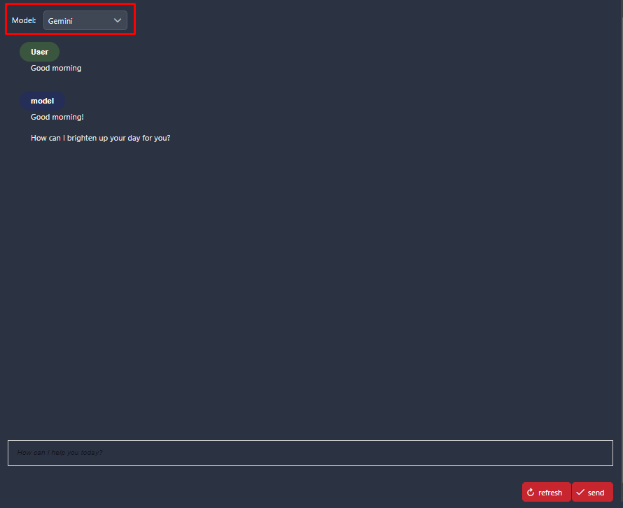
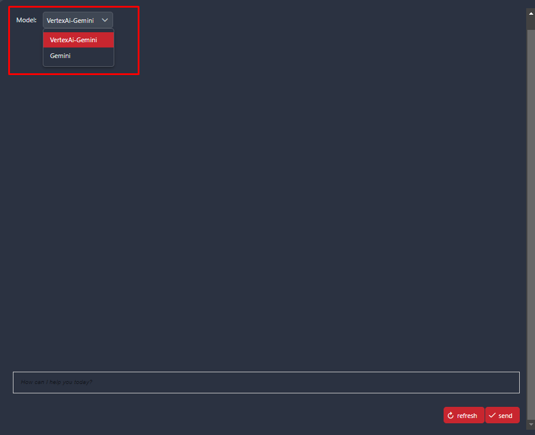
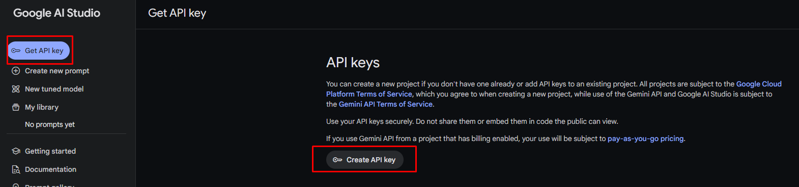
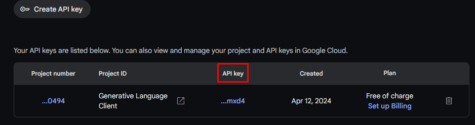
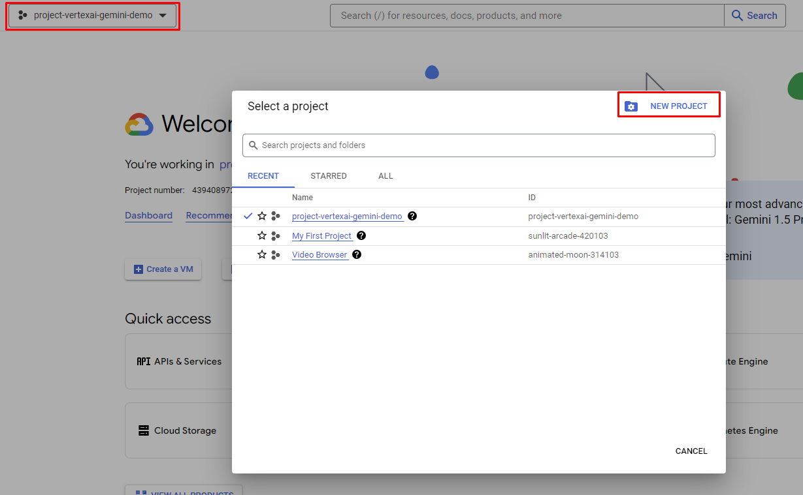
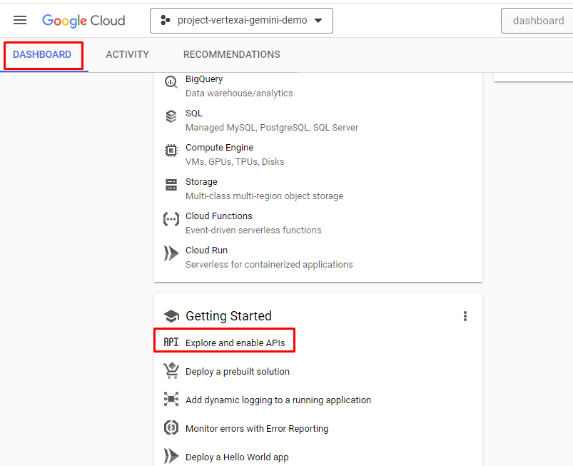
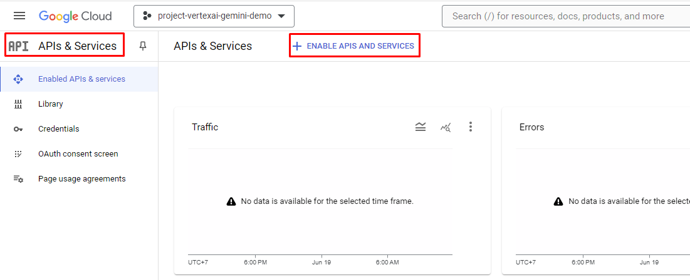
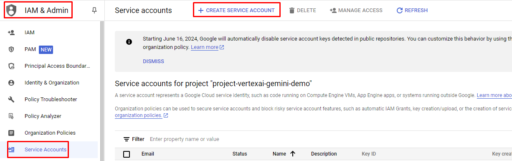

# Vertex AI Google

Vertex AI is a platform offered by Google Cloud designed specifically for developing and deploying machine learning models. It provides a suite of services and tools to support the entire lifecycle of machine learning projects, from data processing and preparation to model development, deployment, and management in production. 

For our connector, we have focused on the Gemini model. Gemini is an AI model, optimized for multimodal tasks, particularly **processing visual and textual inputs**. It enables functionalities such as 
- visual understanding
- classification
- summarization
- and text generation based on images.

## Demo

### Use Case: Text Generation based on images



### Switch between the two models using a dropdown menu

 

Note: For our simple "Cat-Use-Case" it does not make a difference using the Vertex-AI-Gemini-API or the Gemini-API directly.

- Use **Vertex AI Gemini API** if you rather would like to use the cloud based Google AI universe (BigDataQuery, ModelTraining and - deployment, Monitoring and logging).
- If you are looking for a rather flexible, low-cost and ease of use API than use the **Gemini-API** directly.

## Setup

### Gemini

#### Go to Gemini: [Gemini Online](https://aistudio.google.com/app/apikey) and create an API-key



#### Get the API key



### VertexAI

#### Log in to [Vertex Online](https://console.cloud.google.com/) with account

#### Select Dashboard -> Create a new project



#### Copy "Project ID" from project to push to variables file

#### From Dashboard, scroll down to "Getting Started" and select "Explore and enable APIs"



#### Select "ENABLE APIS AND SERVICES"



#### Search "vertex ai api" and enable it (Google Cloud will request billing account) in [Model Garden Gemini-1.5 pro](https://console.cloud.google.com/vertex-ai/publishers/google/model-garden/gemini-1.5-pro-001)

#### Go back to the main page of Google cloud and select **_"IAM & Admin"_**

#### Select **_"IAM & Admin"_** -> **_"Service Accounts"_** -> **_"Create Service Account"_**



#### Create an account and grant permission/role for this account

#### Select the account that just created and select "Key" and choose "ADD key"


#### "ADD Key" -> "Create new Key" -> "Json" -> Google Cloud automatically download a credential json file.

#### Keep this file and put the path of the file to `Variables.vertexaiGemini.keyFilePath`

#### Select the modelName from: [Vertex AI Gemini Model name](https://console.cloud.google.com/vertex-ai/publishers/google/model-garden/gemini-1.5-pro-001)

#### Select the Location from: [Vertex AI Location/Region](https://cloud.google.com/compute/docs/regions-zones)

Add the following `Variables` to your `variables.yaml`:

```
@variables.yaml@
```

and replace the values with your given setup.

> [!NOTE]
> This variable path `vertexai-gemini` is renamed to `vertexaiGemini` from 13.