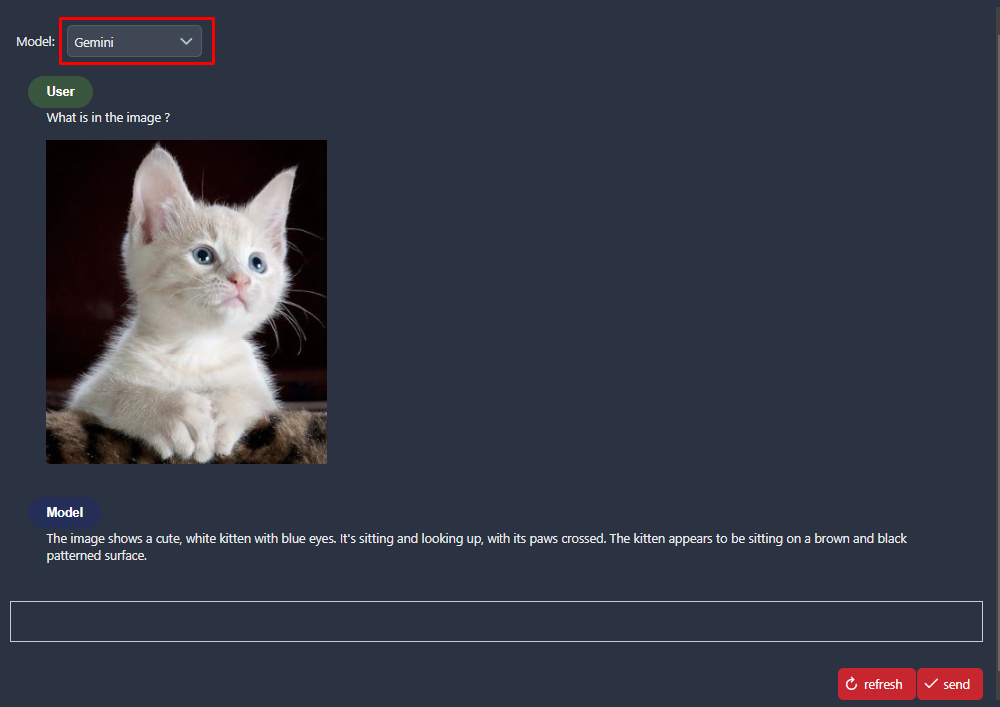
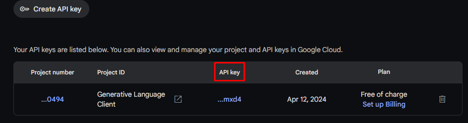
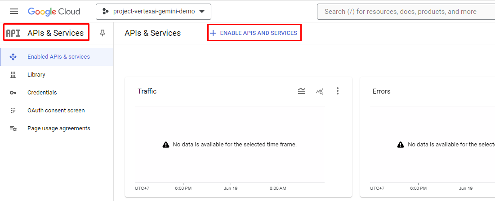

# Vertex AI Google

Vertex AI ist eine von Google Cloud angebotene Plattform, die speziell für die Entwicklung und Bereitstellung von Machine-Learning-Modellen konzipiert wurde. Sie bietet eine Reihe von Diensten und Tools zur Unterstützung des gesamten Lebenszyklus von Machine-Learning-Projekten, von der Datenverarbeitung und -aufbereitung bis hin zur Modellentwicklung, Bereitstellung und Verwaltung in der Produktion. 

Für unseren Konnektor haben wir uns auf das Gemini-Modell konzentriert. Gemini ist ein KI-Modell, das für multimodale Aufgaben optimiert ist, insbesondere für die **Verarbeitung visueller und textueller Eingaben**. Es ermöglicht Funktionen wie 
- visuelles Verständnis
- Klassifizierung
- Zusammenfassung
- und Textgenerierung auf der Grundlage von Bildern.

## Demo

### Anwendungsfall: Textgenerierung auf Basis von Bildern



### Wechseln Sie mithilfe eines Dropdown-Menüs zwischen den beiden Modellen.

 

Hinweis: Für unseren einfachen „Cat-Use-Case” macht es keinen Unterschied, ob Sie die Vertex-AI-Gemini-API oder die Gemini-API direkt verwenden.

- Verwenden Sie die **Vertex AI Gemini API**, wenn Sie lieber das cloudbasierte Google AI-Universum (BigDataQuery, ModelTraining und - Deployment, Monitoring und Logging) nutzen möchten.
- Wenn Sie eine eher flexible, kostengünstige und benutzerfreundliche API suchen, verwenden Sie direkt die **Gemini-API**.

## Einrichtung

### Gemini

#### Gehen Sie zu Gemini: [Gemini Online](https://aistudio.google.com/app/apikey) und erstellen Sie einen API-Schlüssel.


#### API-Schlüssel abrufen



### VertexAI

#### Melden Sie sich mit Ihrem Konto bei [Vertex Online](https://console.cloud.google.com/) an.

#### Wählen Sie Dashboard -> Neues Projekt erstellen


#### Kopieren Sie die „Projekt-ID” aus dem Projekt in die Variablendatei.

#### Scrollen Sie im Dashboard nach unten zu „Erste Schritte“ und wählen Sie „APIs erkunden und aktivieren“ aus.


#### Wählen Sie „APIs UND DIENSTE AKTIVIEREN”.



#### Suchen Sie nach „vertex ai api“ und aktivieren Sie es (Google Cloud fordert ein Abrechnungskonto an) in [Model Garden Gemini-1.5 pro](https://console.cloud.google.com/vertex-ai/publishers/google/model-garden/gemini-1.5-pro-001).

#### Kehren Sie zur Hauptseite von Google Cloud zurück und wählen Sie **_„IAM & Admin“_** aus.

#### Wählen Sie **_„IAM & Admin“_** -> **_„Dienstkonten“_** -> **_„Dienstkonto erstellen“_**


#### Erstellen Sie ein Konto und erteilen Sie diesem Konto Berechtigungen/Rollen.

#### Wählen Sie das soeben erstellte Konto aus, wählen Sie „Schlüssel” und dann „Schlüssel hinzufügen”.


#### „ADD Key“ -> „Create new Key“ -> „Json“ -> Google Cloud lädt automatisch eine JSON-Datei mit Anmeldedaten herunter.

#### Behalten Sie diese Datei und fügen Sie den Pfad der Datei in `Variables.vertexaiGemini.keyFilePath` ein.

#### Wählen Sie den Modellnamen aus: [Vertex AI Gemini Model name](https://console.cloud.google.com/vertex-ai/publishers/google/model-garden/gemini-1.5-pro-001)

#### Wählen Sie den Standort aus: [Vertex AI Standort/Region](https://cloud.google.com/compute/docs/regions-zones)

Fügen Sie die folgenden `Variablen` zu Ihrer `variables.yaml` hinzu:

```
@variables.yaml@
```

Ersetzen Sie die Werte durch Ihre angegebenen Einstellungen.

> [!HINWEIS]
> Der variable Pfad „vertexai-gemini” wird ab Version 13 in „vertexaiGemini” umbenannt.
